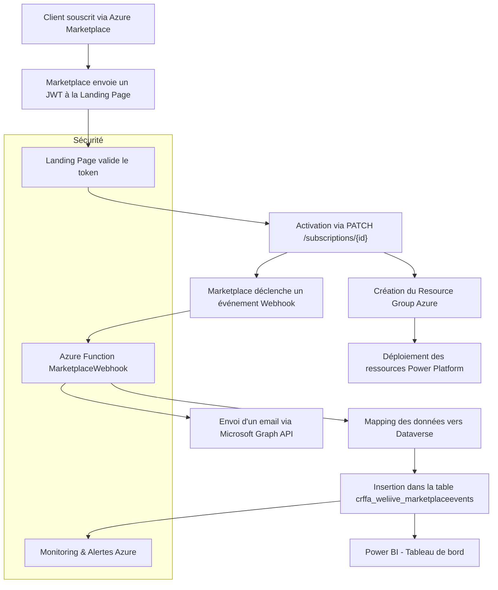

# Documentation Technique – Gestion des Abonnements Marketplace

## 1. Landing Page Client

### Objectif
Accueillir le client après souscription via le Marketplace Azure et déclencher l’activation de son abonnement.

### Fonctionnement
- Le Marketplace envoie une requête HTTP POST vers notre landing page avec un **JWT (JSON Web Token)**.
- La landing page :
  - Décode et valide le token.
  - Envoie une réponse de validation (`PATCH /subscriptions/{id}`) à Microsoft pour activer l’abonnement.
  - Affiche une confirmation au client.

---

## 2. Création du Groupe de Ressources Azure

### Objectif
Isoler les ressources liées à chaque client Marketplace.

### Fonctionnement
- Création dynamique d’un **Resource Group Azure** nommé selon un schéma (`rg-client-{id}`).
- Déploiement des ressources nécessaires (Power Apps, connecteurs, etc.).

---

## 3. Gestion des Événements du Webhook Marketplace

### Objectif
Réagir aux événements liés à l’abonnement (création, mise à jour, suppression) et assurer leur traçabilité.

### Fonctionnement
- Mise en place d’un endpoint sécurisé via **Azure Functions** (`MarketplaceWebhook`).
- Réception des événements Marketplace sous forme de payload JSON.
- Traitement des événements :
  - **Stockage dans Dataverse** via un mapping structuré.
  - **Envoi d’un email automatique** à l’équipe interne avec les détails.
  - **Réponse conditionnelle** à Microsoft (`PATCH`) selon le type d’événement.
- Journalisation :
  - Logs techniques dans **Azure Monitor** pour chaque étape.
  - Gestion des erreurs avec alertes en cas d’échec (Dataverse, email, API).

### Champs stockés dans Dataverse
Les champs extraits du payload et insérés dans la table `crffa_weliive_marketplaceeventses` incluent :

- `crffa_nomdelevenement`
- `crffa_eventtype`
- `crffa_subscriptionid`
- `crffa_planid`
- `crffa_quantity`
- `crffa_status`
- `crffa_timestamp`
- `crffa_beneficiary_tenantid`
- `crffa_beneficiary_email`
- `crffa_purchaser_email`
- `crffa_purchaser_tenantid`
- `crffa_offerid`
- `crffa_allowedcustomeroperations`
- `crffa_term_startdate`
- `crffa_term_enddate`
- `crffa_term_autorenew`
- `crffa_isfreetrial`
- `crffa_istest`
- `crffa_saassubscriptionstatus`
- `crffa_operationid`
- `crffa_activityid`
- `crffa_operationrequestsource`
- `crffa_subscription_name`
- `crffa_subscription_created`
- `crffa_subscription_lastmodified`
- `crffa_subscription_sessionmode`
- `crffa_subscription_sandboxtype`
- `crffa_subscription_termunit`
- `crffa_subscription_chargeduration`
- `crffa_beneficiary_objectid`
- `crffa_beneficiary_puid`
- `crffa_purchaser_objectid`
- `crffa_purchaser_puid`
- `crffa_purchasetoken`

---

## 4. Automatisation des Notifications

### Objectif
Informer les équipes internes ou les clients lors d’un événement.

### Fonctionnement
- Génération automatique d’un email à chaque événement webhook.
- Contenu : informations client, type d’événement, lien vers Dataverse.

---

## 5. Provisioning Automatisé

### Objectif
Activer les services pour le client sans intervention manuelle.

### Fonctionnement
- Utilisation de **Microsoft Graph API** et **Power Platform Admin API** pour :
  - Partager les apps Power Apps.
  - Attribuer ou retirer des rôles et licences.
  - Gérer les groupes de sécurité et environnements.

---

## 6. Sécurisation Avancée (À faire)

### Objectif
Renforcer la sécurité des échanges et des traitements.

### Fonctionnement
- Vérification de signature JWT avec la clé publique Microsoft.
- Gestion des erreurs et alertes critiques.

---

## 7. Tableau de Bord Power BI (À faire)

### Objectif
Visualiser les données d’abonnement et les événements en temps réel.

### Fonctionnement
- Rapport connecté à Dataverse pour visualiser :
  - Abonnements actifs.
  - Événements reçus.
  - Erreurs ou anomalies.

---

## 8. Tests de Bout en Bout (À faire)

### Objectif
Valider l’ensemble du parcours client et les intégrations techniques.

### Fonctionnement
- Simuler le parcours complet client.
- Vérifier l’intégration de tous les composants.

---

## 9. Documentation Technique (En cours)

### Objectif
Formaliser l’ensemble des éléments techniques du projet.

### Fonctionnement
- Rédaction de cette documentation.
- Création d’un diagramme d’architecture.

---

## 10. Architecture Visuelle

### Objectif
Donner une vue d’ensemble du système pour faciliter la compréhension et la maintenance.

### Diagramme de Flux

---

## 11. Composants Clés

### Azure Marketplace : 
Point d’entrée client.

### Landing Page : 
Activation initiale.

### Azure Functions : 
Traitement des événements.

### Dataverse : 
Stockage structuré des événements.

### Power BI : 
Visualisation des abonnements et anomalies.

### Microsoft Graph API : 
Notifications internes.

### Azure Monitor : 
Journalisation et alertes.
